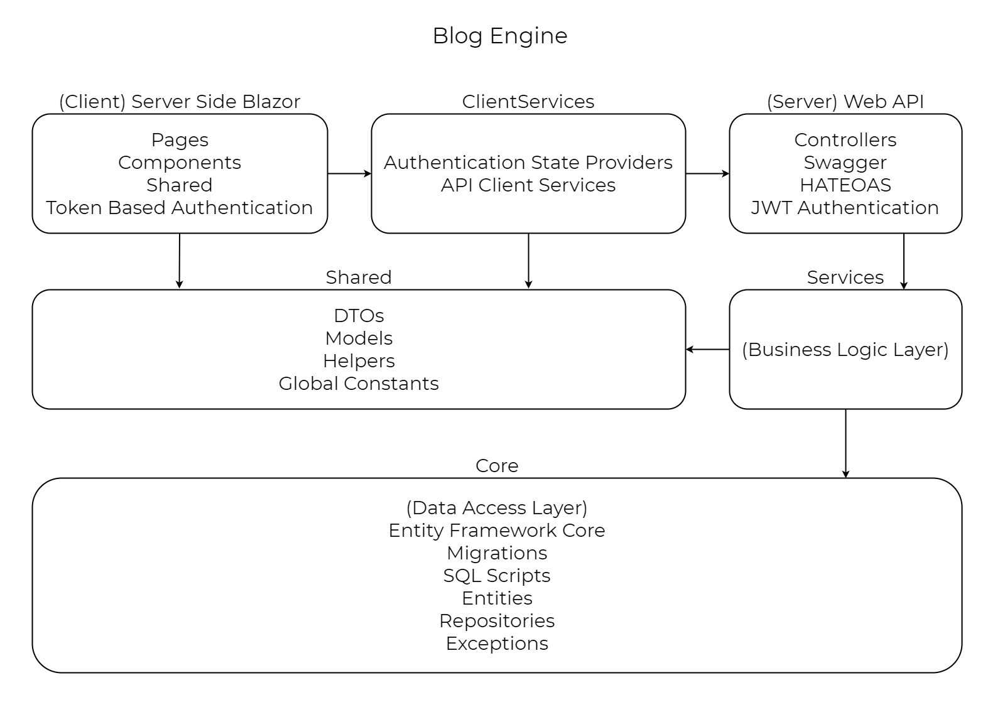

# BlogEngine

A blogging engine based on ASP.NET Core

## Technologies
The project based on modern front edge technologies:
 - Asp.Net Core
 - Blazor Server
 - ASP.NET Core WebAPI
 - Entity Framework Core
 - AutoMapper
 - Syncfusion Blazor
 - Swagger
 - Bootstrap 5
 - BlazorFileReader
 
 ## Features
 - Ability to create and manage
   - Blog
   - Category
   - Subscriber
 - Email notification system
 - Mobile friendly UI
 - Search page with sort functionality
 - Pagination
 - Register/Login system
 - JWT authentication
 - User’s personal account with the ability to edit user information and personal data (upcoming)
 - Administration through the admin panel  
 - Real-Time commenting system with replies
 - Swagger API documentation
 - HATEOAS
 
## Run on local
- Clone the repository
- To create the database for this project, open it in Visual Studio and set the **BlogEngine.Core** project as the default project in **Package Manager Console**. Then enter `Update-Database`. This should create and setup your database for the project.
- Login with the default admin account:
  - **Email**: Admin@gmail.com
  - **Password**: Admin
